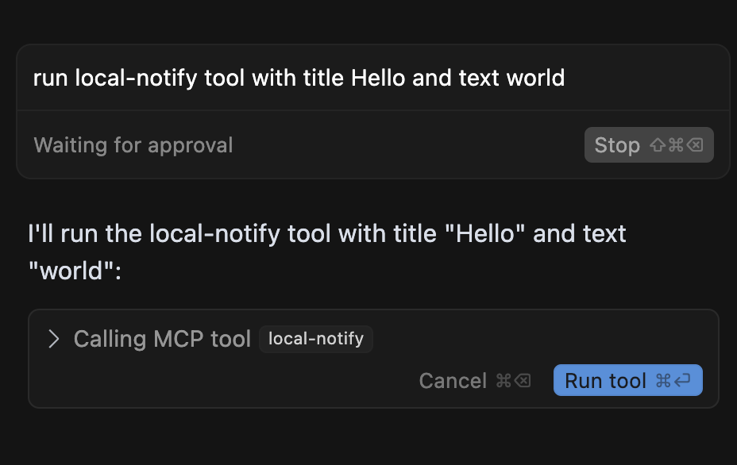
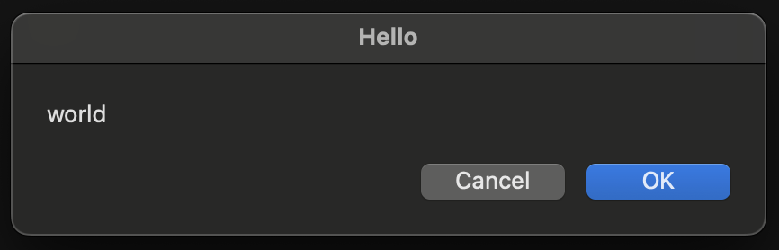

# Swift Local Notify MCP Server

This is a barebones example of an MCP server running in Swift, demonstrating integration with Cursor. The server enables Cursor to display native macOS dialog boxes with customizable title and text messages. It is intended to just be a reference example that can be extended to unlock many different automations with MCP on macOS.

## Overview

When integrated, you can trigger native macOS dialogs directly from Cursor prompts:



Which results in a native dialog appearing on your screen:



## Installation

### Prerequisites

- Xcode 16 or later
- Xcode Command Line Tools

To install Xcode Command Line Tools, run:
```bash
xcode-select --install
```

To verify your Xcode installation:
```bash
xcode-select -p
swift --version
```

### Setup

1. Clone the git repository:
   ```bash
   git clone <repository-url>
   cd $GITHUB_WORKSPACE
   ```

2. Build the project:
   ```bash
   swift build
   ```

3. Configure Cursor by editing `~/.cursor/mcp.json` to include:
   ```json
   {
     "mcpServers": {
       "swift-local-notify": {
         "type": "stdio",
         "command": "$GITHUB_WORKSPACE/.build/debug/swift-local-notify-mcp"
       }
     }
   }
   ```
   > **Note:** Replace `$GITHUB_WORKSPACE` with your actual build directory path.

## Usage

In Cursor, try a prompt like:
```
Run local-notify tool with title Hello and text world
```

You should see a native macOS dialog appear with your specified title and text.

